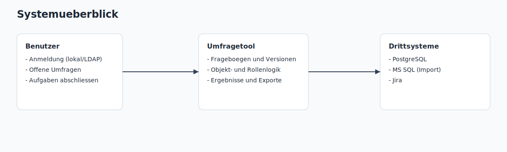
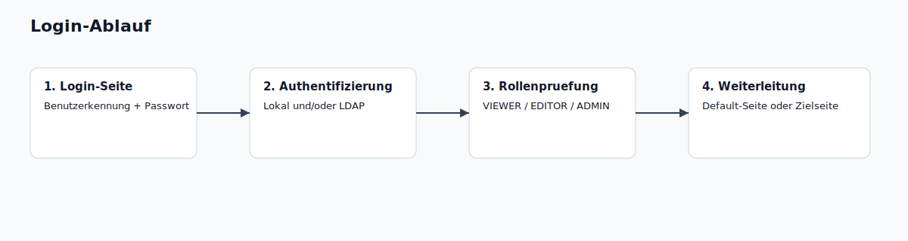
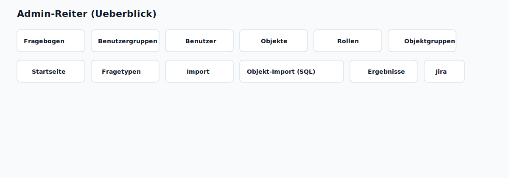
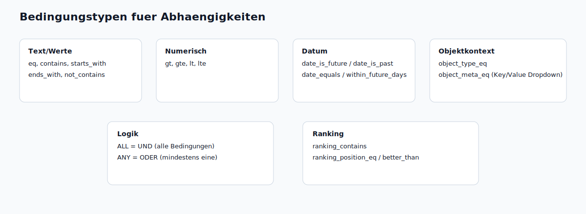
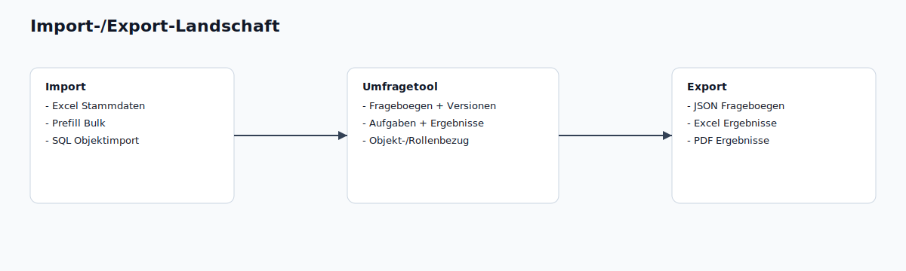

# Endbenutzer-Handbuch

Version: 26.02.2026  
Gueltig fuer: Umfragetool (Web)

Dieses Handbuch beschreibt die Bedienung fuer `VIEWER`, `EDITOR` und `ADMIN`.

## Inhaltsverzeichnis

1. [Rollen und Rechte](#rollen-und-rechte)
2. [Anmeldung](#anmeldung)
3. [Startseite](#startseite)
4. [Umfragen durchfuehren](#umfragen-durchfuehren)
5. [Admin-Bereich - alle Reiter](#admin-bereich---alle-reiter)
6. [Fragetypen](#fragetypen)
7. [Abhaengigkeiten](#abhaengigkeiten)
8. [Import und Export](#import-und-export)
9. [Empfohlener Einfuehrungsablauf](#empfohlener-einfuehrungsablauf)
10. [Fehlerbehebung](#fehlerbehebung)

## Rollen und Rechte

| Rolle | Zweck | Zugriff |
|---|---|---|
| `VIEWER` | Umfragen bearbeiten | Startseite + zugewiesene Umfragen |
| `EDITOR` | Fachliche Administration | Admin-Bereich (ohne Reiter `Benutzer`) |
| `ADMIN` | Volladministration | Alle Reiter inkl. Benutzerverwaltung |

Hinweis:
- `ADMIN` darf alles.
- `EDITOR` sieht und bearbeitet Daten gemaess Sichtbarkeitsregeln (eigene Daten und Daten der eigenen Benutzergruppen).

## Anmeldung

### Login-Maske

- URL: `/login`
- Eingabe:
  - Benutzerkennung (`E-Mail` oder `UserID/Benutzername`)
  - Passwort
- Nach erfolgreicher Anmeldung:
  - Weiterleitung auf konfigurierte Default-Seite oder
  - auf die zuvor angeforderte Zielseite.

### LDAP/AD

- LDAP-Login ist unterstuetzt.
- Bestehende lokale Rollen eines bereits vorhandenen Benutzers bleiben erhalten.
- Neue LDAP-Benutzer koennen automatisch als Benutzer erzeugt werden (typisch mit Rolle `VIEWER`).

### Konfigurierbare Anmeldeseite

Im Reiter `Startseite` (Abschnitt Anmeldeseite):
- Titel, Untertitel, Hinweistext
- Label/Placeholder fuer Benutzer- und Passwortfeld
- Text des Login-Buttons
- Logo (Upload), Breite, Position

## Startseite

Die Startseite ist konfigurierbar und kann enthalten:
- Offene objektbezogene Umfragen
- Globale Fragekataloge
- Abgeschlossene Umfragen

### Offene Umfragen

- Gruppierung:
  - nach Objektgruppen oder
  - nach Objekten
- Links Statistik:
  - Gesamt
  - Offen
  - Erledigt
- Filter:
  - Freitext oder feldbezogen (`titel:`, `objekt:`, `gruppe:`, `status:`)
- Pagination:
  - 10 / 20 / 30 / 40 pro Seite

### Statuslogik

- `OPEN`: Aufgabe kann gestartet/fortgesetzt werden.
- `COMPLETED`: Aufgabe abgeschlossen.
- Bei einer objektbezogenen Umfrage reicht genau ein Abschluss: andere Rolleninhaber sehen sie danach als erledigt (inkl. Zeitstempel und Benutzer).

## Umfragen durchfuehren

### Einstieg

- Objektbezogen: `/task/:id`
- Global: `/link/questionnaire/:id`

### Verhalten waehrend der Durchfuehrung

- Pflichtfragen muessen beantwortet werden.
- Wenn eine Antwort eine Begruendung erfordert, ist das Begruendungsfeld Pflicht.
- Nicht aktive Sektionen/Fragen (Bedingung nicht erfuellt) werden ausgeblendet.
- Die linke Navigation/Fragenuebersicht bleibt sichtbar und folgt der aktuellen Position.

### Vorbefuellung

Bei objektbezogenen Umfragen kann Vorbefuellung verfuegbar sein:
- aus letzter Durchfuehrung (wiederkehrende Umfragen)
- aus importierten Prefill-Daten (Objekt + Fragebogen)

Wichtig:
- Nicht vorbefuellte Pflichtfragen muessen weiterhin beantwortet werden.

### Abschlussseite

Nach Absenden kann eine konfigurierte Abschlussseite angezeigt werden:
- Ueberschrift
- Formatierter Text (WYSIWYG-Inhalt)

## Admin-Bereich - alle Reiter

### Fragebogen

Funktionen:
- Neu anlegen, bearbeiten, duplizieren
- JSON Export/Import
- Loeschen mit Rueckfrage:
  - nur Fragebogen
  - Fragebogen inkl. Ergebnisse

Im Editor:
- Titel, Untertitel, Status, Gueltigkeitszeitraum
- Mehrfachdurchfuehrung
- Globaler Fragebogen ja/nein
- Sektionen/Fragen: erstellen, verschieben, loeschen, Fragen klonen
- WYSIWYG-Beschreibungen
- Abhaengigkeiten (inkl. UND/ODER)
- Grafische Abhaengigkeitssicht
- Konfigurierbare Seite nach Absenden

### Benutzergruppen

- Benutzergruppen anlegen, bearbeiten, loeschen
- Benutzerzuordnung mit Suche, Filter und Pagination
- Hinzufuegen ueber UserID oder E-Mail auch ohne bestehenden Benutzerdatensatz
- Anzeige, ob Benutzer bereits angemeldet war
- Zuordnung von Objektgruppen

### Benutzer (nur ADMIN)

- Benutzer anlegen, bearbeiten, loeschen
- Filter und Pagination
- Statistik (gesamt/importiert)
- Bulk-Loeschen ueber E-Mail-Filter (mit Vorschau)
- Uebersicht je Benutzer:
  - Objekt-Rollen-Zuordnungen
  - Umfragezuordnungen ueber Benutzergruppen/Objekte/Objektgruppen

### Objekte

- Objektliste wird bei grosser Datenmenge erst nach aktivem Filter geladen
- Filter:
  - Text
  - Typ
  - Meta-JSON Key + Value (distinct)
- Aktionen:
  - Objekt erstellen/bearbeiten/loeschen
  - Massenloeschen (z. B. "Alle vom Typ loeschen")
- Uebersicht je Objekt:
  - zugeordnete Umfragen + Status
  - Rollenzuordnungen pro Rolle (Anzahl Personen)

Objektdetail:
- Objekt-ID, Name, Typ, Beschreibung, Metadaten
- Rollenzuordnungen
- Objektgruppen
- Umfrage-/Policy-Zuordnungen
- Vorbefuellung exportieren/importieren (Excel)

### Rollen

- Rollen frei verwalten
- Nutzung/Anzahl je Rolle sichtbar

### Objektgruppen

- Objektgruppen anlegen/bearbeiten/loeschen
- Objekte zuordnen:
  - manuell
  - per Suche
  - per Bulk-Auswahl
  - per Regel-Engine
- Overrides pro Objekt
- Anzeige von Objektanzahl und Umfragezuordnung

### Startseite

- Startseiteninhalte je Benutzer konfigurierbar:
  - Ueberschriften, Beschreibungen
  - Sichtbarkeit einzelner Bloecke
  - Gruppierungslogik
  - Default-Seite nach Login
- Login-Seite ebenfalls dort konfigurierbar

### Fragetypen

- Baukasten: Fragetypen aktivieren/deaktivieren
- Wirkung nur fuer neue Frageboegen
- Bestehende Frageboegen bleiben lauffaehig
- Nutzungsauswertung je Fragetyp:
  - Anzahl Frageboegen
  - Anzahl Fragen

### Import

- Excel-Massenimport ueber Sheets:
  - `users`, `objects`, `roles`, `role_assignments`, `policies`, `object_groups`, `group_memberships`, `group_policies`
- Objekt-Schluessel ist `object_id`
- Benutzer-Mapping in Zuordnungen ueber `user_email` oder `user_id`
- Zusatz:
  - Wartung/Bereinigung
  - Prefill-Massenimport (`prefill_bulk`)

### Objekt-Import (SQL)

- Mehrere Importjobs
- Importtyp:
  - Objekte
  - Personen + Rollen + Objektzuordnung
- SQL im Editor pflegbar
- Test/Dry-Run + Ausfuehrung
- Optionales Loeschen fehlender Datensaetze
- Laufhistorie je Job

### Ergebnisse

Funktionen:
- Ergebnisliste je Fragebogen und Version
- Einzel-Export:
  - Excel
  - PDF
- Gesamt-Exports:
  - Gesamt-Excel (alle Ergebnisse)
  - Excel je Fragebogen ueber alle Versionen
- Originaldesign (readonly) in separatem Fenster
- Originaldesign als PDF
- Ergebnis einzeln loeschbar
- Jira-Ticket aus Ergebnis erzeugen

### Jira

- Konfigurationsstatus sichtbar
- Jira Ticket erstellen aus Ergebnis
- Jira Debug:
  - Dry-Run
  - Live-Test
- Ticket abrufen ueber Bereich + Ticketnummer

## Fragetypen

| Fragetyp | Beschreibung | Wichtige Optionen |
|---|---|---|
| `info` | Hinweistext ohne Antwortfeld | kein Pflichtfeld, keine Antwort |
| `text` | Einzeiliger Text | Placeholder |
| `multiline` | Mehrzeiliger Text | WYSIWYG-Beschreibung |
| `boolean` | Ja/Nein | optional begruendungspflichtig ueber Antwortlogik |
| `single` | Einzelauswahl | individuelle Antworten erlauben |
| `multi` | Mehrfachauswahl | individuelle Antworten erlauben |
| `date_time` | Datum / Datum+Uhrzeit | Modus waehlbar |
| `percentage` | Prozentangabe | Eingabe, Slider oder Auswahl |
| `likert` | Skala | Stufen + Min/Max-Label |
| `ranking` | Rangfolge | Position-basierte Bedingungen |
| `object_picker` | Objektwahl | Typ-/Metafilter, Objektgruppen, Mehrfachmodus, Zusatzfelder |

## Abhaengigkeiten

Bedingungen koennen auf Frage- oder Sektionsebene definiert werden.

### Logik

- `UND` (`ALL`): alle Bedingungen muessen zutreffen
- `ODER` (`ANY`): mindestens eine Bedingung muss zutreffen

### Unterstuetzte Operatoren

- Text/Werte:
  - `eq`, `contains`, `not_contains`, `starts_with`, `ends_with`
- Numerisch:
  - `gt`, `gte`, `lt`, `lte`
- Datum:
  - `date_is_future`, `date_is_past`, `date_equals`, `date_within_future_days`
- Ranking:
  - `ranking_contains`, `ranking_position_eq`, `ranking_position_better_than`
- Objektkontext:
  - `object_type_eq`
  - `object_meta_eq`

### Objekt-Meta-Bedingung

Bei `object_meta_eq`:
- `Meta-Key` wird ueber Dropdown gewaehlt
- `Meta-Wert` kommt als distinct Dropdown zum gewaehlten Key
- kein Freitext

Hinweis:
- Bei globalen Umfragen ohne Objekt sind objektbezogene Bedingungen nicht erfuellt.

## Import und Export

### Fragebogen

- JSON Export/Import im Reiter `Fragebogen`
- Versionierung bei Aenderungen an laufenden Katalogen

### Ergebnisse

- Einzel-Excel / Einzel-PDF
- Gesamt-Excel
- Fragebogen-Excel ueber alle Versionen

### Vorbefuellung

- Objektbezogene Excel-Vorlagen exportieren
- Ausgefuellte Vorbefuellungen wieder importieren
- Massenimport ueber `prefill_bulk` moeglich

### Stammdaten

- Excel-Massenimport
- SQL-basierter externer Objektimport

## Empfohlener Einfuehrungsablauf

1. Rollen anlegen
2. Benutzergruppen anlegen
3. Benutzer importieren/zuordnen
4. Objekte importieren (inkl. Metadaten)
5. Objektgruppen definieren (Regel-Engine + manuell)
6. Rollen am Objekt zuordnen
7. Frageboegen erstellen/veroeffentlichen
8. Policies an Objekt/Objektgruppe binden
9. Optional Vorbefuellung importieren
10. Ergebnisse und Jira-Prozess nutzen

## Fehlerbehebung

### Benutzer sieht keine Umfrage

- Rollen-/Gruppenzuordnung fehlt
- Policy ist nicht aktiv (Zeitfenster/Frequenz)
- Bedingung auf Objekt/Antwort trifft nicht zu

### Import war "erfolgreich", aber Daten fehlen

- Falsches Sheet/Spaltenformat
- Mapping-Spalten unvollstaendig
- `object_id` nicht vorhanden oder nicht eindeutig

### Objektliste zeigt nichts

- Kein aktiver Filter gesetzt (gewolltes Verhalten bei grosser Datenmenge)

---

Stand: 26.02.2026  
Quelle: aktueller Funktionsstand im Projekt.
