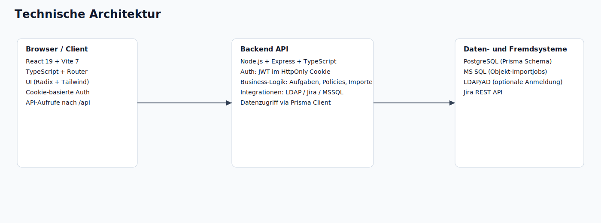
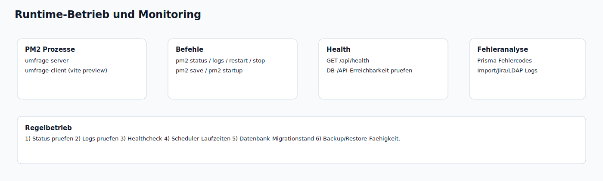
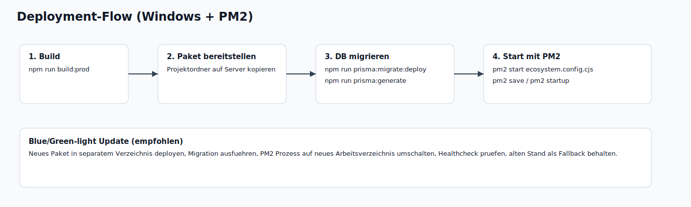
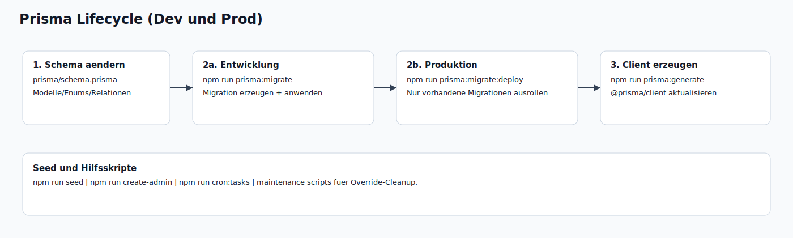
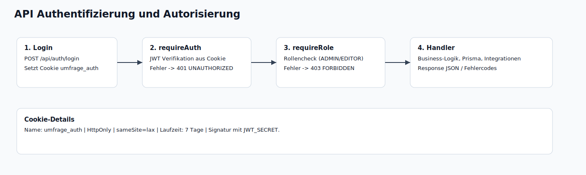

# Technische Dokumentation

Version: 26.02.2026  
Zielsystem: Windows Server + PM2 + PostgreSQL

Diese Dokumentation beschreibt den technischen Betrieb, Deployment, Datenbankbetrieb, Integrationen und die API des Umfragetools.



## Inhaltsverzeichnis

1. [Systemueberblick](#systemueberblick)
2. [Technologie-Stack](#technologie-stack)
3. [Repository- und Laufzeitstruktur](#repository--und-laufzeitstruktur)
4. [Konfiguration (Parameterdeck)](#konfiguration-parameterdeck)
5. [Start, Stopp, Monitoring](#start-stopp-monitoring)
6. [Deployment (Windows + PM2)](#deployment-windows--pm2)
7. [Datenbank und Prisma](#datenbank-und-prisma)
8. [API-Referenz](#api-referenz)
9. [Integrationen](#integrationen)
10. [Sicherheit und Betrieb](#sicherheit-und-betrieb)
11. [Troubleshooting-Playbook](#troubleshooting-playbook)
12. [Anhang](#anhang)

## Systemueberblick

### Scope

- Frontend (React/Vite) fuer Benutzer- und Adminoberflaeche
- Backend (Express) fuer Auth, Fachlogik, Import/Export, Integrationen
- PostgreSQL als Primärdatenbank via Prisma
- Externe Integrationen: LDAP (AD), Jira, MSSQL-Import

### Laufzeitfluesse

- Browser -> `/:5173` (Client) -> `/api/*` (Backend Proxy im Dev, direkter Aufruf im Prod)
- Backend -> PostgreSQL (Prisma Client)
- Backend -> LDAP/Jira/MSSQL (bei aktivierter Funktion)

## Technologie-Stack

| Bereich | Technologien |
|---|---|
| Sprache | TypeScript, SQL |
| Frontend | React 19, React Router 7, Vite 7, Tailwind CSS 4, Radix UI |
| Backend | Node.js, Express 4, cookie-parser, cors, jsonwebtoken, bcryptjs |
| Datenbank | PostgreSQL, Prisma 5.20.0 |
| Import/Export | xlsx, jsPDF |
| Integrationen | ldapts, mssql, Jira REST |
| Prozessmanager | PM2 |

## Repository- und Laufzeitstruktur

| Pfad | Zweck |
|---|---|
| `src/` | Frontend-App (Pages, Komponenten, API-Client) |
| `server/src/` | Backend API, Auth, LDAP, Cron, Wartungsskripte |
| `prisma/schema.prisma` | Datenmodell (Prisma) |
| `dist/` | Build-Artefakte Frontend |
| `dist-server/` | Build-Artefakte Backend |
| `ecosystem.config.cjs` | PM2-Konfiguration |
| `.env` / `.env.example` | Laufzeitkonfiguration |
| `docs/` | Endbenutzer- und Technikdokumentation |

### Entrypoints

- Frontend Dev: `vite` (`npm run dev`)
- Backend Dev: `tsx server/src/index.ts` (`npm run dev:server`)
- Frontend Prod: `vite preview --host 0.0.0.0 --port 5173` (`npm run start:client`)
- Backend Prod: `node dist-server/index.js` (`npm run start:server`)

## Konfiguration (Parameterdeck)

> Es sind nur Platzhalterwerte zu verwenden. Keine produktiven Secrets in Doku, Git oder Tickets.

| Variable | Typ | Pflicht | Default | Wirkung / Hinweis |
|---|---|---|---|---|
| `DATABASE_URL` | URL | Ja | - | PostgreSQL Verbindung fuer Prisma |
| `JWT_SECRET` | String | Ja | `change-me`/`dev-secret` | Signatur fuer Auth-Cookie Token |
| `CORS_ORIGIN` | URL | Ja | `http://localhost:5173` | Erlaubter Browser-Origin fuer API |
| `PORT` | Number | Nein | `4000` | Backend-Port |
| `AUTH_MODE` | Enum | Nein | `local` oder `both` in Prod | Loginmodus (`local`, `ldap`, `both`) |
| `ADMIN_EMAIL` | String | Nein | `admin@example.com` | fuer `seed`/`create-admin` |
| `ADMIN_PASSWORD` | String | Nein | `admin123` | fuer `seed`/`create-admin` |
| `LDAP_ENABLED` | Bool | Nein | `false` | LDAP aktiv/inaktiv |
| `LDAP_URL` | URL | Bei LDAP | - | LDAP Server URL |
| `LDAP_DOMAIN` | String | Optional | - | Domain fuer Bind (DOMAIN\\user) |
| `LDAP_SEARCH_BASE` | String | Bei LDAP | - | LDAP Base DN |
| `LDAP_SEARCH_FILTER` | String | Nein | `(sAMAccountName={{username}})` | Suchfilter mit Platzhalter |
| `LDAP_EMAIL_ATTR` | String | Nein | `mail` | E-Mail Attributname |
| `LDAP_NAME_ATTR` | String | Nein | `cn` | Anzeigename Attributname |
| `LDAP_ALLOW_UPN` | Bool | Nein | `false` | UPN Login erlaubt |
| `LDAP_GROUP_ATTR` | String | Nein | `memberOf` | Gruppenattribut |
| `LDAP_ROLE_MAP` | String | Optional | - | Mapping AD-Gruppe -> Rolle |
| `LDAP_DEBUG` | Bool | Nein | `false` | Erweiterte LDAP Fehlermeldungen |
| `LDAP_TIMEOUT_MS` | Number | Nein | `8000` | LDAP Timeout |
| `JIRA_ISSUE_CREATE_URL` | URL | Fuer Jira | - | Endpoint Ticket erstellen |
| `JIRA_ISSUE_BROWSE_URL` | URL | Optional | - | Linkbasis Ticket anzeigen |
| `JIRA_USER_SEARCH_URL` | URL | Optional | - | Endpoint Benutzer suchen |
| `JIRA_BASIC_AUTH` | String | Fuer Jira | - | Basic Auth Headerwert |
| `JIRA_DEFAULT_PROJECT_KEY` | String | Optional | `PIT` | Standard Projekt-Key |
| `JIRA_DEFAULT_ISSUE_TYPE` | String | Optional | `Task` | Standard Issue Type |
| `JIRA_CONTACT_CUSTOM_FIELD_ID` | String | Optional | `customfield_11341` | Ansprechpartner-Feld |
| `JIRA_EPIC_NAME_CUSTOM_FIELD_ID` | String | Optional | `customfield_10941` | Epic Name Feld |
| `JIRA_DEFAULT_COMPONENTS` | CSV | Optional | - | Jira Komponenten |
| `EXTERNAL_IMPORT_SCHEDULER_ENABLED` | Bool | Nein | `true` | Scheduler fuer SQL-Importjobs |
| `EXTERNAL_IMPORT_SCHEDULER_TICK_MS` | Number | Nein | `60000` | Scheduler Intervall |
| `EXTERNAL_IMPORT_PRISMA_TIMEOUT_MS` | Number | Nein | `120000` | Prisma Timeout fuer grosse Importe |

## Start, Stopp, Monitoring



### Entwicklung

```bash
npm install
npm run dev
npm run dev:server
```

### Produktion (ohne PM2)

```bash
npm run build:prod
npm run start:server
npm run start:client
```

### PM2 Betrieb

```bash
pm2 start ecosystem.config.cjs
pm2 status
pm2 logs umfrage-server
pm2 logs umfrage-client
pm2 restart umfrage-server
pm2 restart umfrage-client
pm2 stop umfrage-server
pm2 stop umfrage-client
pm2 save
pm2 startup
```

### Healthcheck

```bash
curl http://localhost:4000/api/health
```

PowerShell:

```powershell
Invoke-RestMethod -Method Get -Uri "http://localhost:4000/api/health"
```

## Deployment (Windows + PM2)



### Standard-Deployment

1. Build im Quellsystem:
   - `npm run build:prod`
2. Projekt auf Zielserver kopieren (inkl. `dist`, `dist-server`, `prisma`, `node_modules` bei Offline-Betrieb).
3. `.env` auf Zielserver setzen.
4. Prisma Deployment:
   - `npm run prisma:migrate:deploy`
   - `npm run prisma:generate`
5. PM2 starten:
   - `pm2 start ecosystem.config.cjs`
   - `pm2 save`
6. Healthcheck + Login pruefen.

### Offline-Szenario

- Ohne Internet muss `node_modules` mitgeliefert werden oder ein internes Paket-Repository vorhanden sein.
- Wenn `npm install` offline nicht moeglich ist:
  - Build und `prisma generate` vorab in Online-Umgebung
  - Artefakte plus lauffaehige `node_modules` transportieren

### Netzwerk/Firewall

- Typische Ports:
  - `4000` Backend
  - `5173` Frontend Preview
- In Produktionsnetzen meist Reverse Proxy empfohlen (TLS, Domainrouting).

### Update-Strategie (Blue/Green-light)

- Neues Release in separatem Verzeichnis deployen
- DB-Migrationen vor Umschalten anwenden
- PM2 auf neues Working Directory umschalten
- Healthcheck pruefen
- Altes Release kurzfristig als Fallback behalten

## Datenbank und Prisma



### Kernmodelle (vereinfacht)

- Benutzer/Gruppen: `User`, `Group`, `GroupMember`
- Frageboegen: `Questionnaire`, `Submission`, `GroupQuestionnaire`
- Objektwelt: `ObjectEntity`, `RoleDefinition`, `ObjectRoleAssignment`
- Aufgaben/Policies: `ObjectSurveyPolicy`, `ObjectSurveyTask`, `ObjectGroupPolicy`, `ObjectPolicyOverride`
- Objektgruppen/Regeln: `ObjectGroup`, `ObjectGroupMembership`, `ObjectGroupRule`, `GroupObjectGroup`

### Prisma-Befehle

```bash
npm run prisma:generate
npm run prisma:migrate
npm run prisma:migrate:deploy
npm run seed
```

### Migrationsstrategie

- Development:
  - `prisma migrate dev` (generiert und wendet neue Migrationen an)
- Produktion:
  - `prisma migrate deploy` (nur vorhandene Migrationen)
  - kein `migrate dev` auf Prod

### Typische Prisma-Fehler

| Code | Bedeutung | Typische Ursache | Loesung |
|---|---|---|---|
| `P1001` | DB nicht erreichbar | Host/Port/Firewall/Service down | DB Service, URL, Netzwerk pruefen |
| `P2002` | Unique Constraint | Dublette bei unique Feld | Daten bereinigen, Upsert/Skip-Logik |
| `P2003` | Foreign Key Fehler | Referenzierte Daten fehlen | Loesch-/Anlage-Reihenfolge korrigieren |
| `P2022` | Spalte fehlt | Migrationen nicht ausgerollt | `prisma migrate deploy` + generate |

## API-Referenz



### Auth-Modell

- Login setzt HttpOnly Cookie `umfrage_auth` (JWT, 7 Tage)
- Middleware:
  - `requireAuth` -> 401 bei fehlender/ungueltiger Auth
  - `requireRole([...])` -> 403 bei fehlender Rolle

### Standard-Fehlercodes

- `400 BAD_REQUEST` - Eingabefehler / Validierung
- `401 UNAUTHORIZED` - nicht angemeldet
- `403 FORBIDDEN` - Rolle/Berechtigung fehlt
- `404 NOT_FOUND` - Ressource nicht gefunden
- `409 CONFLICT` - Konflikt (z. B. Duplikate)
- `500 INTERNAL_SERVER_ERROR` - unerwarteter Backendfehler

### API-Nutzung (Beispiele)

#### Login

```bash
curl -X POST http://localhost:4000/api/auth/login \
  -H "Content-Type: application/json" \
  -d '{"email":"admin@example.com","password":"<PASSWORD>"}' \
  -c cookie.txt
```

PowerShell:

```powershell
$body = @{ email = "admin@example.com"; password = "<PASSWORD>" } | ConvertTo-Json
Invoke-RestMethod -Method Post -Uri "http://localhost:4000/api/auth/login" -ContentType "application/json" -Body $body -SessionVariable sess
```

#### Authentifizierter Request

```bash
curl http://localhost:4000/api/me/object-tasks -b cookie.txt
```

PowerShell:

```powershell
Invoke-RestMethod -Method Get -Uri "http://localhost:4000/api/me/object-tasks" -WebSession $sess
```

### API-Inventar (vollstaendig)

| Methode | Pfad | Auth/Rolle |
|---|---|---|
| `GET` | `/api/health` | `PUBLIC` |
| `POST` | `/api/auth/login` | `PUBLIC` |
| `POST` | `/api/auth/logout` | `PUBLIC` |
| `GET` | `/api/auth/me` | `PUBLIC` |
| `GET` | `/api/me/home-config` | `AUTHENTICATED` |
| `GET` | `/api/public/login-config` | `PUBLIC` |
| `GET` | `/api/admin/home-config` | `ADMIN,EDITOR` |
| `PUT` | `/api/admin/home-config` | `ADMIN` |
| `GET` | `/api/admin/login-config` | `ADMIN,EDITOR` |
| `PUT` | `/api/admin/login-config` | `ADMIN` |
| `GET` | `/api/users` | `ADMIN,EDITOR` |
| `GET` | `/api/users/:id/submissions` | `ADMIN` |
| `GET` | `/api/users/:id/assignment-overview` | `ADMIN,EDITOR` |
| `POST` | `/api/users/:id/reset` | `ADMIN` |
| `POST` | `/api/users` | `ADMIN,EDITOR` |
| `PUT` | `/api/users/:id` | `ADMIN,EDITOR` |
| `DELETE` | `/api/users/:id` | `ADMIN,EDITOR` |
| `POST` | `/api/users/bulk-delete` | `ADMIN` |
| `POST` | `/api/users/bulk-delete/preview` | `ADMIN` |
| `GET` | `/api/groups` | `ADMIN,EDITOR` |
| `GET` | `/api/groups/:id` | `ADMIN,EDITOR` |
| `POST` | `/api/groups` | `ADMIN,EDITOR` |
| `PUT` | `/api/groups/:id` | `ADMIN,EDITOR` |
| `DELETE` | `/api/groups/:id` | `ADMIN,EDITOR` |
| `GET` | `/api/groups/:id/members` | `ADMIN,EDITOR` |
| `PUT` | `/api/groups/:id/members` | `ADMIN,EDITOR` |
| `GET` | `/api/groups/:id/questionnaires` | `ADMIN,EDITOR` |
| `GET` | `/api/groups/:id/object-groups` | `ADMIN,EDITOR` |
| `PUT` | `/api/groups/:id/questionnaires` | `ADMIN,EDITOR` |
| `PUT` | `/api/groups/:id/object-groups` | `ADMIN,EDITOR` |
| `GET` | `/api/objects` | `ADMIN,EDITOR` |
| `GET` | `/api/objects/with-groups` | `ADMIN,EDITOR` |
| `GET` | `/api/admin/object-picker/filter-options` | `ADMIN,EDITOR` |
| `POST` | `/api/objects` | `ADMIN,EDITOR` |
| `PUT` | `/api/objects/:id` | `ADMIN,EDITOR` |
| `DELETE` | `/api/objects/:id` | `ADMIN,EDITOR` |
| `GET` | `/api/objects/:id/prefills/:questionnaireId` | `ADMIN,EDITOR` |
| `POST` | `/api/prefills/bulk` | `ADMIN,EDITOR` |
| `PUT` | `/api/objects/:id/prefills/:questionnaireId` | `ADMIN,EDITOR` |
| `POST` | `/api/objects/bulk-delete` | `ADMIN,EDITOR` |
| `GET` | `/api/roles` | `ADMIN,EDITOR` |
| `GET` | `/api/objects/:id/groups` | `ADMIN,EDITOR` |
| `GET` | `/api/object-groups` | `ADMIN,EDITOR` |
| `GET` | `/api/object-groups/summary` | `ADMIN,EDITOR` |
| `POST` | `/api/object-groups` | `ADMIN,EDITOR` |
| `PUT` | `/api/object-groups/:id` | `ADMIN,EDITOR` |
| `DELETE` | `/api/object-groups/:id` | `ADMIN,EDITOR` |
| `GET` | `/api/object-groups/:id/members` | `ADMIN,EDITOR` |
| `GET` | `/api/object-groups/:id/rules` | `ADMIN,EDITOR` |
| `GET` | `/api/object-groups/:id/rule-config` | `ADMIN,EDITOR` |
| `PUT` | `/api/object-groups/:id/rule-config` | `ADMIN,EDITOR` |
| `POST` | `/api/object-groups/:id/rules` | `ADMIN,EDITOR` |
| `DELETE` | `/api/object-group-rules/:id` | `ADMIN,EDITOR` |
| `POST` | `/api/object-groups/:id/apply-rules` | `ADMIN,EDITOR` |
| `PUT` | `/api/object-groups/:id/members` | `ADMIN,EDITOR` |
| `GET` | `/api/object-groups/:id/policies` | `ADMIN,EDITOR` |
| `GET` | `/api/object-groups/:id/summary` | `ADMIN,EDITOR` |
| `POST` | `/api/object-groups/:id/policies` | `ADMIN,EDITOR` |
| `DELETE` | `/api/object-group-policies/:id` | `ADMIN,EDITOR` |
| `GET` | `/api/objects/:id/overrides` | `ADMIN,EDITOR` |
| `POST` | `/api/objects/:id/overrides` | `ADMIN,EDITOR` |
| `DELETE` | `/api/object-overrides/:id` | `ADMIN,EDITOR` |
| `POST` | `/api/roles` | `ADMIN,EDITOR` |
| `PUT` | `/api/roles/:id` | `ADMIN,EDITOR` |
| `DELETE` | `/api/roles/:id` | `ADMIN,EDITOR` |
| `GET` | `/api/objects/:id/assignments` | `ADMIN,EDITOR` |
| `PUT` | `/api/objects/:id/assignments` | `ADMIN,EDITOR` |
| `GET` | `/api/objects/:id/policies` | `ADMIN,EDITOR` |
| `GET` | `/api/objects/:id/summary` | `ADMIN,EDITOR` |
| `GET` | `/api/objects/:id/tasks` | `ADMIN,EDITOR` |
| `POST` | `/api/objects/:id/policies` | `ADMIN,EDITOR` |
| `PUT` | `/api/policies/:id` | `ADMIN,EDITOR` |
| `DELETE` | `/api/policies/:id` | `ADMIN,EDITOR` |
| `GET` | `/api/object-import-definitions` | `ADMIN,EDITOR` |
| `GET` | `/api/object-import-definitions/:id` | `ADMIN,EDITOR` |
| `GET` | `/api/object-import-definitions/:id/runs` | `ADMIN,EDITOR` |
| `POST` | `/api/object-import-definitions` | `ADMIN,EDITOR` |
| `PUT` | `/api/object-import-definitions/:id` | `ADMIN,EDITOR` |
| `DELETE` | `/api/object-import-definitions/:id` | `ADMIN,EDITOR` |
| `POST` | `/api/object-import-definitions/:id/test` | `ADMIN,EDITOR` |
| `POST` | `/api/object-import-definitions/:id/run` | `ADMIN,EDITOR` |
| `POST` | `/api/import/bulk` | `ADMIN,EDITOR` |
| `GET` | `/api/admin/question-types` | `ADMIN,EDITOR` |
| `PUT` | `/api/admin/question-types` | `ADMIN` |
| `GET` | `/api/questionnaires` | `ADMIN,EDITOR` |
| `GET` | `/api/questionnaires/:id` | `AUTHENTICATED` |
| `POST` | `/api/questionnaires` | `ADMIN,EDITOR` |
| `PUT` | `/api/questionnaires/:id` | `ADMIN,EDITOR` |
| `DELETE` | `/api/questionnaires/:id` | `ADMIN,EDITOR` |
| `GET` | `/api/me/questionnaires` | `AUTHENTICATED` |
| `GET` | `/api/me/submissions` | `AUTHENTICATED` |
| `GET` | `/api/me/object-picker-options` | `AUTHENTICATED` |
| `GET` | `/api/me/object-tasks` | `AUTHENTICATED` |
| `GET` | `/api/object-tasks/:id` | `AUTHENTICATED` |
| `GET` | `/api/object-tasks/:id/prefill` | `AUTHENTICATED` |
| `POST` | `/api/object-tasks/:id/submit` | `AUTHENTICATED` |
| `POST` | `/api/questionnaires/:id/submissions` | `AUTHENTICATED` |
| `GET` | `/api/questionnaires/:id/submissions` | `ADMIN,EDITOR` |
| `DELETE` | `/api/submissions/:id` | `ADMIN,EDITOR` |
| `GET` | `/api/integrations/jira/meta` | `ADMIN` |
| `POST` | `/api/integrations/jira/debug/create` | `ADMIN` |
| `GET` | `/api/integrations/jira/issues/:projectKey/:issueNumber` | `ADMIN` |
| `GET` | `/api/integrations/jira/users` | `ADMIN` |
| `POST` | `/api/integrations/jira/issues` | `ADMIN` |
| `POST` | `/api/admin/maintenance/override-cleanup` | `ADMIN` |

### API-Domains: wichtigste Request-/Response-Strukturen

#### Auth

- `POST /api/auth/login`
  - Body: `{ email, password }`
  - Response: Benutzerobjekt + Auth-Cookie
- `POST /api/auth/logout`
  - Response: `{ ok: true }` (Cookie wird geloescht)
- `GET /api/auth/me`
  - Response: aktueller Benutzer oder `401`

#### Benutzer / Gruppen / Rollen

- Benutzer anlegen/aktualisieren: `email`, `password` (optional bei Update), `role`, `displayName`
- Gruppen: `name`, `description`, Mitgliederlisten
- Rollen: Name + CRUD

#### Objekte / Policies / Tasks

- Objekt: `externalId`, `name`, `type`, `description`, `metadata`
- Policy: `questionnaireId`, `frequency`, `intervalDays`, `activeFrom`, `activeTo`, Rollenbezug
- Task Submit: Antwortenobjekt je Fragen-ID

#### Frageboegen / Ergebnisse

- Fragebogen: Titel, Sektionen (JSON), Status, Version, Sichtbarkeitskontext
- Submission: `answers`, Snapshot/Version, `submittedAt`

#### SQL-Importjobs

- Definition: Verbindung (`sqlHost`, `sqlPort`, `sqlDatabase`, `sqlUsername`, `sqlPassword`, TLS-Optionen), SQL-Query, Mapping
- Test/Run: Dry-Run und produktiver Lauf, Laufhistorie via `/runs`

#### Jira

- Meta/Status, User-Suche, Ticket erstellen, Debug-Create, Ticket abruf

## Integrationen

### LDAP

- Implementierung: `server/src/ldap.ts`
- Ablauf:
  1. Bind mit Benutzerkennung/Passwort
  2. Suche im LDAP-Tree
  3. Mapping von Mail/Name/Gruppen
  4. Rollenmapping via `LDAP_ROLE_MAP`

### Jira

- Konfiguration ueber `JIRA_*` Variablen
- REST-Funktionen:
  - Ticket erstellen
  - Debug create (dry/live)
  - User-Suche
  - Ticket abruf

### MSSQL Objektimport

- Endpunkte unter `/api/object-import-definitions*`
- SQL Query und Mapping per Admin konfigurierbar
- Scheduler via `EXTERNAL_IMPORT_SCHEDULER_*`
- Prisma-Timeout fuer lange Writes via `EXTERNAL_IMPORT_PRISMA_TIMEOUT_MS`

## Sicherheit und Betrieb

- Auth Token nur in HttpOnly Cookie
- CORS restriktiv auf `CORS_ORIGIN`
- Secrets nur in `.env`, nicht im Code/Repo
- Fuer Production TLS ueber Reverse Proxy erzwingen
- Logging:
  - `pm2 logs`
  - gezielte Debug-Flags (`LDAP_DEBUG`)

## Troubleshooting-Playbook

| Problem | Diagnose | Loesung |
|---|---|---|
| Server startet nicht | `pm2 logs umfrage-server` | fehlende Module, Pfade, `.env` pruefen |
| `tsx` nicht gefunden | Dev-only Tool fehlt | `npm install` bzw. Build auf Quellsystem |
| `P1001` DB nicht erreichbar | `DATABASE_URL`, Port, Service | PostgreSQL starten, Firewall, URL korrigieren |
| `P2022` Spalte fehlt | Migrationstand veraltet | `npm run prisma:migrate:deploy` |
| Foreign key Fehler (`P2003`) | Loesch-/Importreihenfolge falsch | Referenzdaten zuerst anlegen oder Cascading cleanup |
| Unique Fehler (`P2002`) | Dublette bei unique Feld | Upsert/Skip-Strategie, Daten bereinigen |
| Frontend laden faellt aus | Browser-Konsole + PM2 logs | Build neu erstellen, Cache leeren, statische Dateien pruefen |
| Jira Ticket wird nicht erstellt | `/api/integrations/jira/meta` + Debug-Endpunkt | Auth/URL/Field IDs pruefen |
| LDAP Login faellt aus | `LDAP_DEBUG=true` + Netzwerk | URL/BaseDN/Filter/Bind pruefen |

## Anhang

### NPM Kommandoreferenz

| Kommando | Zweck |
|---|---|
| `npm run dev` | Frontend Devserver |
| `npm run dev:server` | Backend Devserver |
| `npm run build:client` | Frontend Build |
| `npm run build:server` | Backend Build |
| `npm run build:prod` | Prisma generate + Client + Server Build |
| `npm run start:client` | Frontend Preview |
| `npm run start:server` | Backend Start aus `dist-server` |
| `npm run prisma:generate` | Prisma Client erzeugen |
| `npm run prisma:migrate` | Migration dev |
| `npm run prisma:migrate:deploy` | Migration prod |
| `npm run seed` | Seed Daten |
| `npm run create-admin` | Admin anlegen |
| `npm run cron:tasks` | Task-Cron Lauf |
| `npm run maintenance:override-cleanup:dry` | Dry-run Bereinigung |
| `npm run maintenance:override-cleanup` | Bereinigung anwenden |

### Rollenmatrix (API)

| Rolle | Zugriff |
|---|---|
| `PUBLIC` | health, login/logout, public login-config |
| `AUTHENTICATED` | me-Endpunkte, Objekt-Tasks, Submission senden |
| `EDITOR` | Admin-Fachfunktionen (ohne Admin-only Endpunkte) |
| `ADMIN` | Vollzugriff inkl. Benutzerverwaltung, Jira-API, Wartung |

### API-Index kompakt

- Alle Routen sind im Abschnitt „API-Inventar (vollstaendig)“ gelistet.
- Source of Truth: `server/src/index.ts`

---

Stand: 26.02.2026
